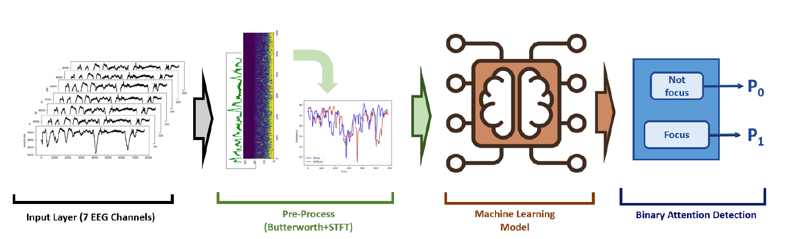

# EEG-based Attention Detection Systems
### Versatile Machine Learning Based Brain Attention Detection Systems


## Reference Citation
[1] Wang, J.; Kim, S.-K. Novel Machine Learning-Based Brain Attention Detection Systems. Information 2025, 16, 25. https://doi.org/10.3390/info16010025

[2] Aci, C.I.; Kaya, M.; Mishchenko, Y. Distinguishing mental attention states of humans via an EEG-based passive BCI using machine learning methods. Expert Systems with Applications 2019, 134, 153–166.

[3] EEG Dataset (https://www.kaggle.com/datasets/inancigdem/eeg-data-for-mental-attention-state-detection)

[4] One solution created by Xiang (https://www.kaggle.com/code/xianglanosu/eeg-protocol-3-states)



## Training Environment
Python == 3.12.7

torch == 2.5.1 with CUDA runtime == 12.4

torchaudio == 2.5.1

torchvision == 0.20.1

matplotlib

numpy

openpyxl

pandas

scikit-learn

scikit-learn-intelex

seaborn

tqdm

tensorboard

## Revision History
```
2025.01.04: The paper has been accepted.
2025.01.04: Upload the EEG-based system code in Github (v.01).
2025.01.06: Update paper citation.
```

#### Code created by *Genn* [v.01 || 2025/01/04]